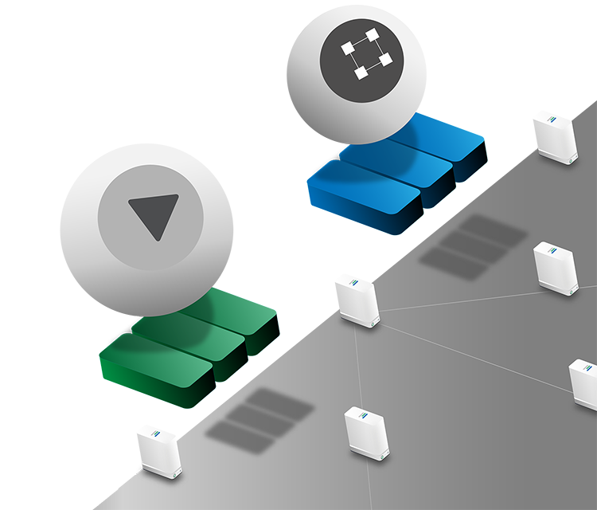

# Why is TF VDC so secure?

## Running on an OS with no hacking surface

Zero-OS is the operating system that runs on the Threefold nodes. All weaknesses of an operating system with regards to hacking have been considered and eradicated in the implementation of this peer-to-peer OS. 
- It has no shell, meaning that farmers, i.e. owners of the servers have no access to the data nor the applications running on their hardware. 
- Management and workloads running on the grid are not in the hands of humans. This excludes human error and malicious hackers. Bots take over this role: we have bots that act as virtual system administrators.

## Network security

All networking setup in Zero-OS for application running in containers is done as private overlay peer-to-peer connections. All 3nodesthat are part of application architecture have their own IPv6 address.  All traffic between containers is encrypted.  

The private networking between container is by default not connected to the outside world. Connections to the outside world is created by deploying a web gateway. These web gateways act as servers to the containers in the private network and forward traffic that needs to be sent to the outside network.  There will never be a direct connection from the outsinde to containers.

## Quantum-secure Storage 

3nodes with zero-OS running on it are storage generators.  zero-OS make all the internal disks available to any 3bot on the grid.  

The storage architecture is build around the principle of using disks everwhere.  The difference between an archvie solutions and a performing storage solution is proximity between the used disks.  The closer together the disks (or disk slices) are more more performance can be achieved witht he storage solution.

The storage architecture must have access to many disks (or disk slices) on which is can store data parts.  Data parts are created by an algorith that uses "_forward_ _error_ _correcting_" principles to create descriptions of data parts of an object that need to be stored.  These descriptions are _not_  _encrypted_ data parts but a mathematical description of that data part.  The original data object can only be retrieved if all pieces are available to the algorithm and it can solve the mathematical system.  

The fact that it is a mathematical description of a data part and not encrypted data makes the storage solution quantum safe:  If one of the data parts is found (hacked) it does not allow a quantum computer to crack the encnyption used for that part as all data parts are needed to recreate the original objects.  Sufficient spread of these data parts make it impossible to get all data parts by hacking all 3nodes / disks used to store the data parts.

 [here](https://manual.threefold.io/#/architecture_storage?id=dispersed-storage-architecture-design-philosophy). 

## Security in the deployment process

Deployment of IT workloads using a so-called “Smart Contract for IT” makes the deployment process resilient to human error and hacking. The system is self-driving and self-healing, removing the human elemeent for deploying and operating IT infrastructure and services. 

This is a breakthrough in IT. 3Bot records all transactions within the blockchain database (BCDB), ensuring an immutable record of any workload and enables the self-healing functionality as any workload can easily be restored if/when needed.

## Fully decentralized access

Access to your virtual data center happen through Threefold connect app. This app is a fully decentralized authentication mechanism, based on PKI technology. 

