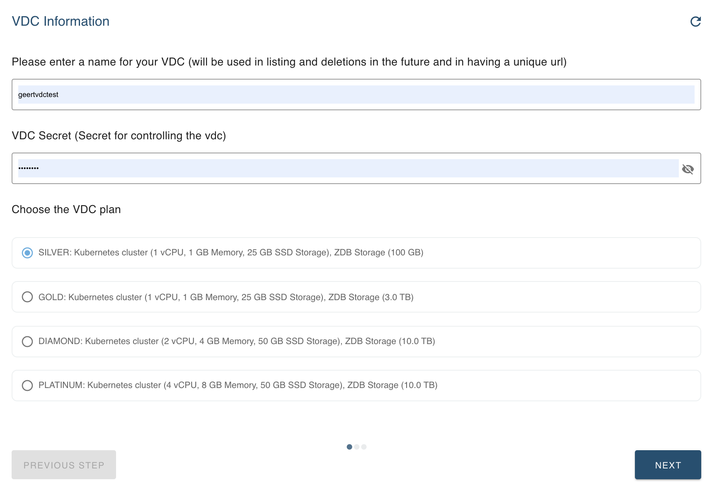
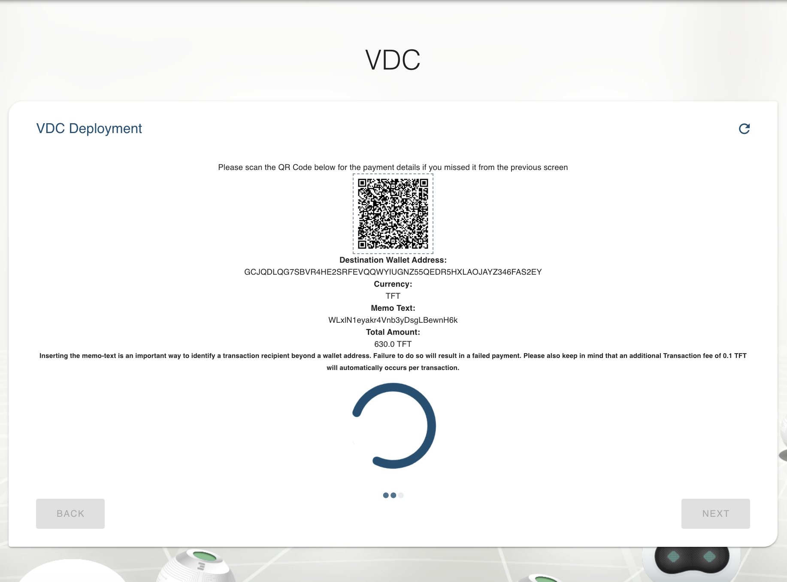
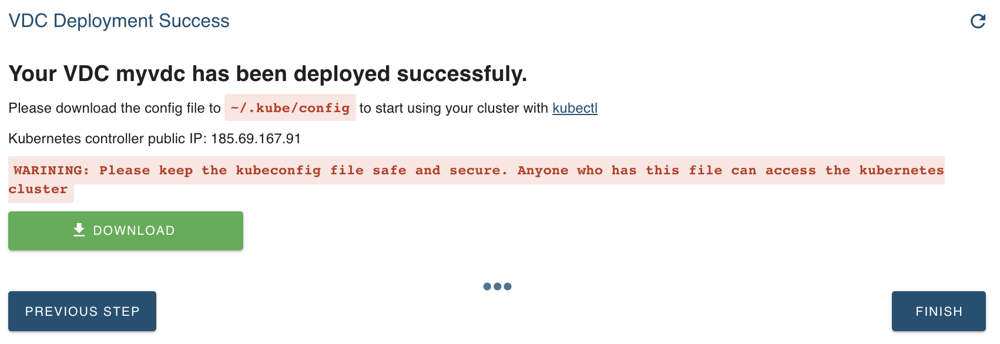

# Add a VDC

You can creating your own Virtual Data Center in just a few clicks. Go to the [website](https://vdc.grid.tf) and log in using your Threefold Connect App.

To create your VDC, click `Deploy a VDC`.

Only limited information is needed: a name, a secret password, and the size of your VDC (this can be adapted over time).

Now the VDC is being prepared to be used by you.
Full deployment can start after payment.
The amount to be paid is calculated to cover the capacity for the selected VDC size for a period of 1 month.

After payment, the process takes a while, as many steps happen behind the scene:
- The requested capacity is reserved
- The VDC wallets are generated, allowing you to extend the reservation of your capacity
  - A 'prepaid' wallet is accessible both to you and the VDC provider. This is the wallet that you need to fund
  - A 'provisioning' wallet holds the tokens that are reserved to pay the farmers according to a predefined plan, making sure sufficient funding is available for 2 weeks of operation.
- A public IP is reserved to make your cluster available to the outside world
- A K3S instance of Kubernetes is deployed for your VDC

After all these steps, your VDC is ready for exploitation !
A kubeconfig file is generated and can be downloaded.

Remark: keep this file secure and safe, as it contains all info for anyone to access the K8S cluster.

