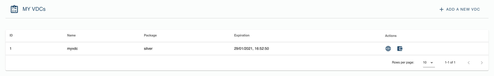
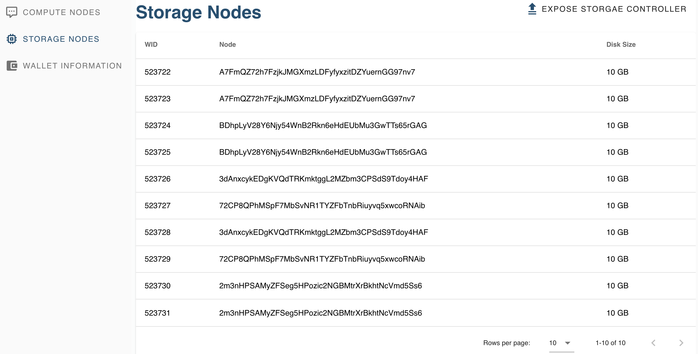
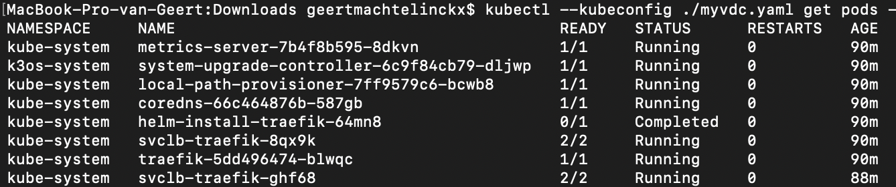

# Manage your VDC

The VDCs under your control can be found by clicking on the `LIST VDCS` button of the homepage.

A list is shown of available VDCs, with a link to the VDC itself, or to manager the funding of the capacity for it. On the same page, you can also start the setup of a new VDC.

Clicking on the url link of the VDC brings you to a login page. Log in using your ThreeFold Connect App.

Before starting to run your VDC, a welcome screen is shown, as well as `Terms and conditions`. Please have a read and push `Agree` before continuing.

The portal shows you the Kubernetes cluster that has been created corresponding to the chosen size.

Details on both master and workers are visible.

