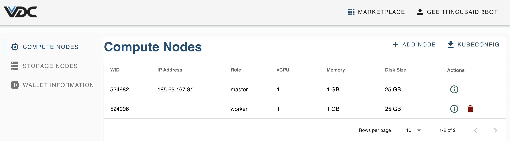
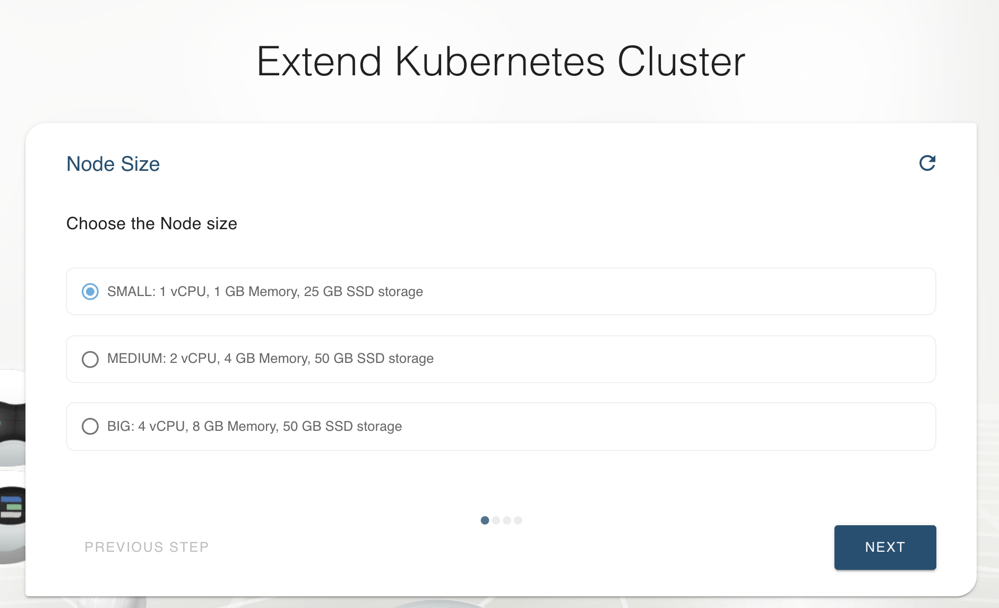
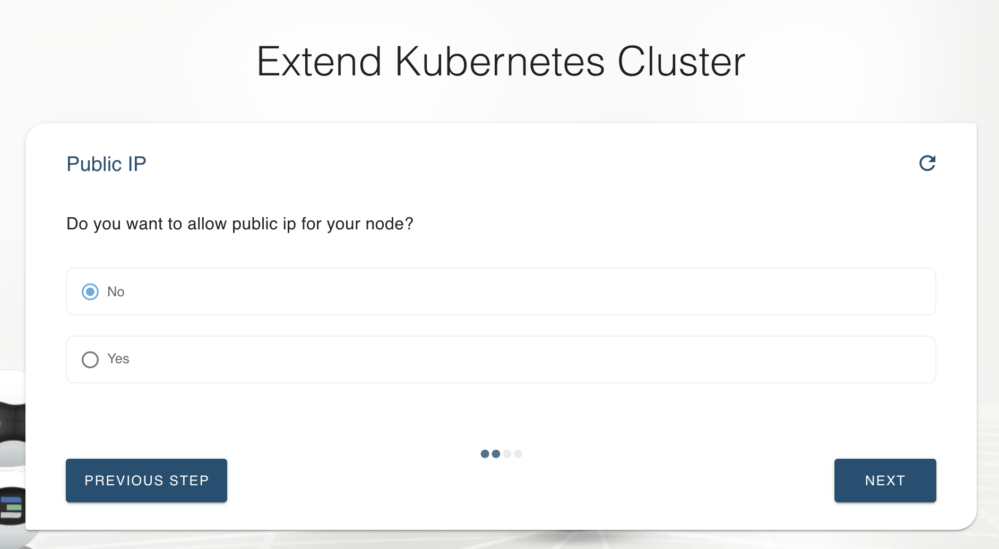
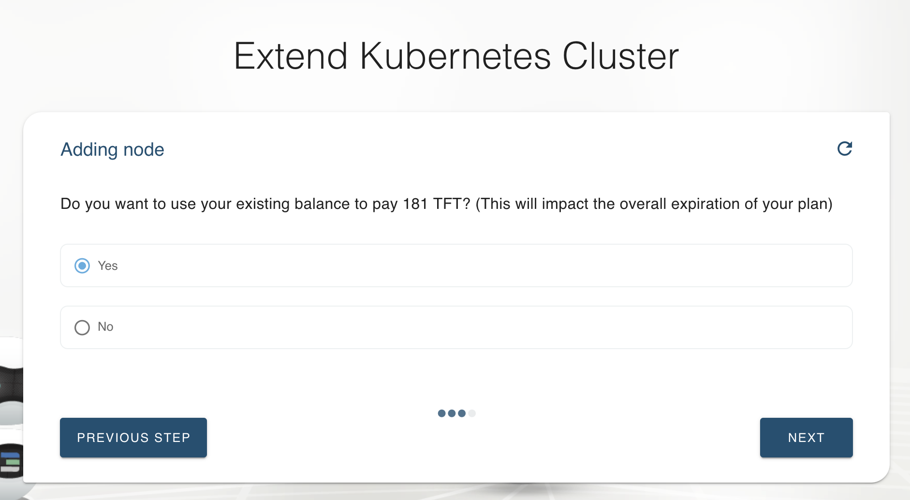
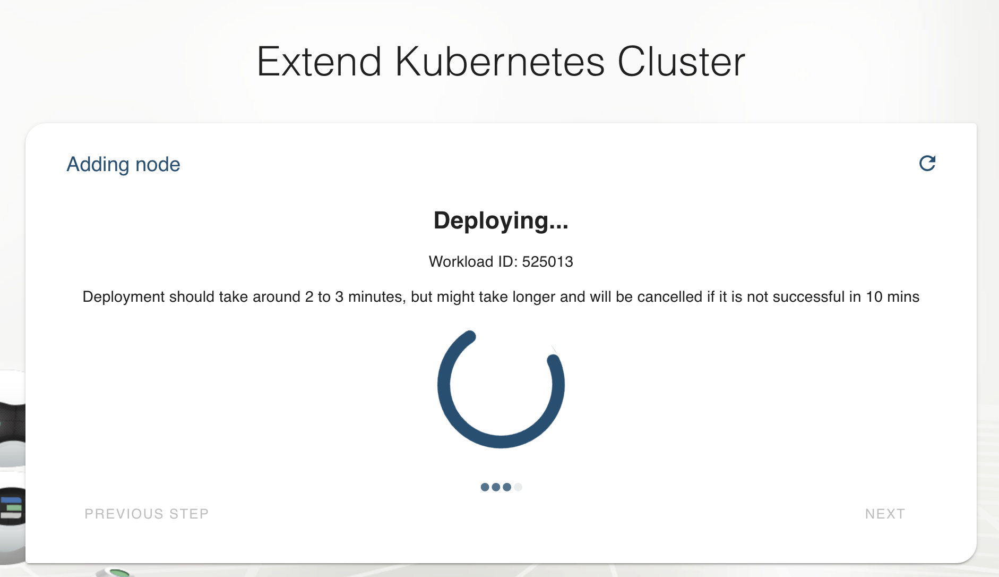
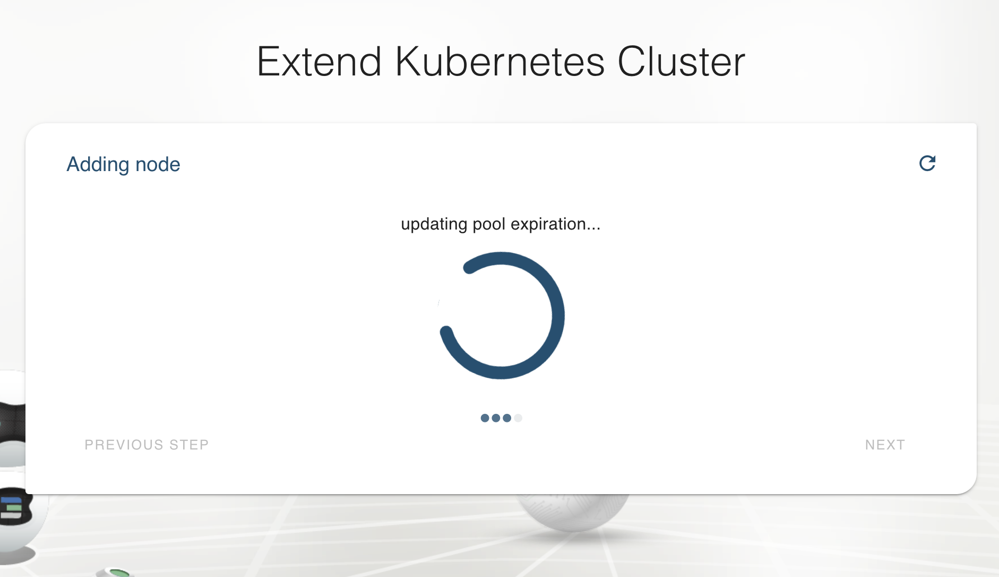
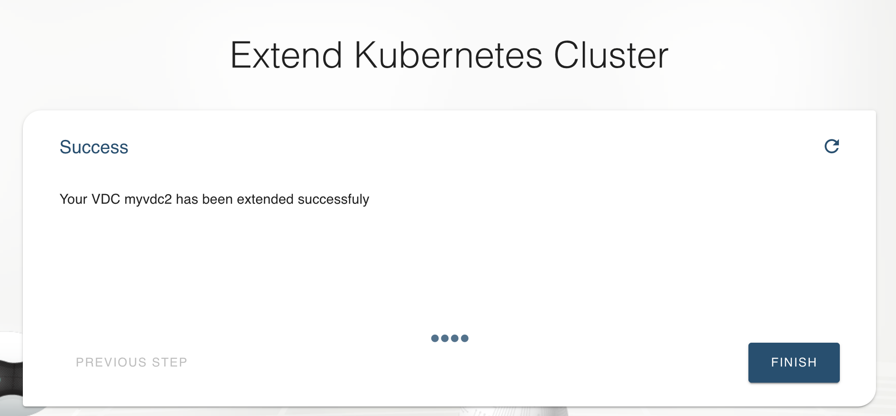

# Upgrade VDC Capacity

Your VDC can also be upgraded when it is up and running.

## Extend a Kubernetes cluster

A Kubernetes cluster can be extended with additional worker nodes, through a few steps.

Click on the `Add Node` button.

Select the size of the node (Small, Medium, Big).

 Choose whether this additional node needs to be exposed directly to the internet with a public IPv4 address.

 

 Choose the way to pay: with a new token transfer or using already transferred tokens (but this will shorten the time before your total reservation will expire).

 

 After these steps, execution of the extension will start.

 
 
 
 
